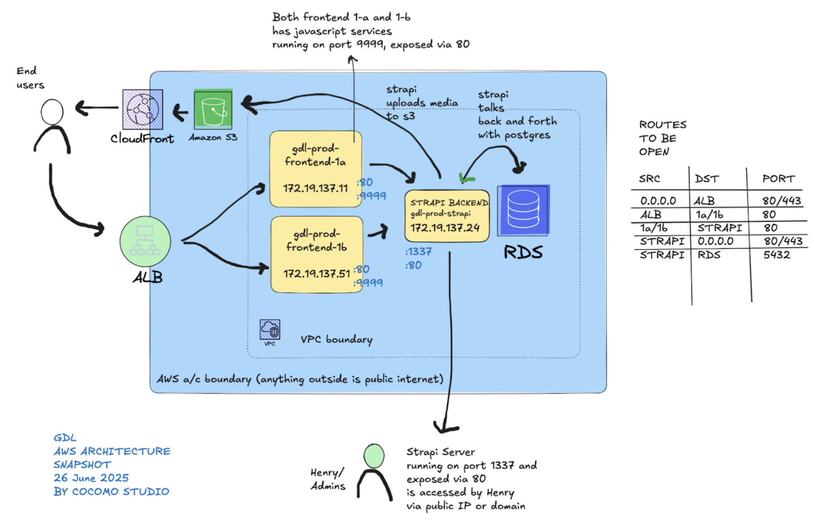

**GDL AWS Application Operation Manual**

**Developed by**  
Suhas Guruprasad \<suhas@postcube.net\>  
Aditya Mohana Bhat \<aditya.mohana.bhat@gmail.com\>  
Aroushka D’Mello \<aroushka@cocomo.studio\>

**Cocomo Studio**

**Owned and sponsored by**  
Henry Skupniewicz \<henry@godrej.com\>

**Operated by**  
Shruti Desai \<dshruti@godrej.com\>

**IT leadership by**  
Rengarajan Iyer \<renga@godrej.com\>

**Document audience**  
Anyone in the Godrej team that might operate this project on AWS.

**[Introduction](#introduction)**

[**Architecture bird’s eye view**](#architecture-bird’s-eye-view)

[Application bill of materials](#application-bill-of-materials)

[Entry points](#entry-points)

[Operational workflow](#operational-workflow)

[**Installation loop**](#installation-loop)

[Step 1: System dependencies](#step-1:-system-dependencies)

[Step 2: Fetching the application code repository](#step-2:-fetching-the-application-code-repository)

[Step 3: Configuration](#step-3:-configuration)

[Step 4: Building and running the application](#step-4:-building-and-running-the-application)

[**Monitoring, debugging and restarting the application**](#monitoring,-debugging-and-restarting-the-application)

[**Conclusion**](#conclusion)


# **Introduction** {#introduction}

This introduction provides a high level technical overview of the project. The scope of this document is technical and focuses on the operational aspects of the GDL project. If the reader is curious for more context on the project itself, or its history, a good point of contact for enquiry is Henry, the owner and the sponsor of this project. This project was developed and built by Cocomo Studio, a design agency that builds and develops a wide variety of projects. 

The GDL project primarily consists of two main components, (1) a modified Strapi CMS package, and (2) a fully custom built frontend in Reactjs. These two components have been custom configured to run on AWS natively. This documentation assumes that all necessary infrastructure on AWS has been manually provisioned via the AWS Console web UI.

Strapi is an open-source headless CMS, a modern alternative to wordpress, that supports custom building certain components in order to best fit in a client’s environment. In this project, we have extensively modified and simplified the Strapi project and tailored it purposefully for the GDL project. The specificity of the modifications itself is out of scope of this documentation, but however the curious reader can browse through the source code installed on AWS if they wish to learn further.

The frontend is a ground up custom built Reactjs application. We have followed the best modern web practices and code standards to build the application. We will learn more about these two components as we go through this operation manual.

# **Architecture bird’s eye view** {#architecture-bird’s-eye-view}

Before diving in further, let’s look at and internalize the birds eye view of the project and its architecture.



At a glance the stack is a classic three-tier Frontend \+ API \+ DB arrangement, fully inside a single AWS account / VPC. Note that this architecture's bird's eye view does not include Godrej-specific security, firewall and other implementations. Having said that, let’s look at the application architecture bill of materials below.

## **Application bill of materials** {#application-bill-of-materials}

1. Two EC2 instances[^1] dedicated to the frontend. As of July 2025, these two have been named gdl-prod-frontend-1a (172.19.137.11) and gdl-prod-frontend-1b (172.19.137.51). Henceforth we will refer to these collectively or interchangeably as the **frontend 1a/1b** instances.  
2. One ALB that acts as the router to the two frontend 1a and frontend 1b instances. Henceforth we will simply refer to this as the **ALB**.  
3. One EC2 instance[^2] dedicated to the strapi CMS or the backend. As of July 2025, this instance has been named gdl-prod-strapi (172.19.137.24). Henceforth we will refer to this as the **strapi** instance.   
4. One RDS postgres 17 as the application database that hosts all the application data and metadata via the strapi instance. Henceforth we will simply refer to this as the **RDS**.  
5. An **S3** bucket that stores media (images and videos) via the strapi instance.  
6. A **CloudFront** distribution that serves the media from the S3 bucket to the end users.

## **Entry points** {#entry-points}

There are three entry points into the application from the external world or the Internet. 

1. The first entry point is for the admin (Henry) who uploads blog posts and corresponding photos or videos into the Strapi instance. Therefore the strapi instance will be exposed via DNS at some URL like cms-designlab.godrejenterprises.com or cms.designlab.godrejenterprises.com or some such. For simplicity, let’s refer to this URL in this document as the **CMS URL**.  
2. The second entry point is for the end users, who will actually visit and browse this website. Therefore the ALB to the frontend instances will be exposed via DNS at some URL like designlab.godrejenterprises.com or some such. For simplicity, let’s refer to this URL in this document as the **FRONTEND URL**.  
3. The third entry point while public is not necessarily directly ever accessed by any user or admin is the CloudFront. The CloudFront acts as a Content Delivery Network (CDN) and is publicly available via DNS at some URL like cdn-designlab.godrejenterprises.com or perhaps even abcdefg.cloudfront.net or some such. Let’s refer to this URL as the **CDN URL**.

## **Operational workflow** {#operational-workflow}

1. Henry uploads blog posts and corresponding media content after logging in to the strapi web UI interface accessible at CMS URL via a web browser (e.g. Chrome or Edge)  
   1. The Strapi instance then appropriately saves the data entered in the UI by Henry into the RDS database  
   2. It uploads the media into the S3 bucket   
2. User hits FRONTEND URL via a web browser  
   1. DNS sends them to the ALB which routes them to frontend-1a/1b EC2 instances for the web page content  
   2. Frontend-1a/1b EC2 instances talk via HTTP to Strapi instance and query for the relevant content to serve the user  
   3. Strapi instance loads the relevant data from RDS and responds back via HTTP to the Frontend-1a/1b  
   4. The frontend instances then serve the web page to the user  
   5. Web page via browser sends them to CDN URL for media content  
   6. CloudFront serves the media from cache or S3

In summary for the users, HTTP calls flow through an Application Load Balancer (ALB) to two EC2 frontend instances. Those instances speak HTTP to a Strapi EC2 host, which in turn serves the content back after querying RDS. The web page loads in the browser, and static assets (media) are retrieved from the  CloudFront.

# **Installation loop** {#installation-loop}

The core installation loop or procedure for both the **CMS** and the **FRONTEND** can be broken down into the below four steps which we will take a look at in detail, one by one.

1. System dependencies  
2. Fetching the application code repository  
3. Configuration  
4. Building and running the node process

Note that the core installation loop (i.e. all the above four steps) have been already performed before the handover of this project by Cocomo Studio to the Godrej team.

## **Step 1: System dependencies** {#step-1:-system-dependencies}

Dependency \#1 \- NVM

The node version manager to manage and maintain our node version, can be installed by running the below command

```bash
$ curl -o- https://raw.githubusercontent.com/nvm-sh/nvm/v0.40.3/install.sh | bash
```

Note that the admin running the above install command will need access to the Internet, or allow listing githubusercontent.com for egress.

Dependency \#2 \- Node

With NVM installed in the above step, it is fairly simple for the admin to install the LTS version of node. At this time of writing, the LTS version is at 22.17, and hence the development of this application and any support will be pinned and frozen to Node 22.17.

```bash
$ nvm install 22.17
```

The command to install node 22.17 with nvm illustrated above[^3].  
   
Dependency \#3 \- pnpm and pm2

**pnpm** is an alternative to **npm**. We extensively use pnpm, a fast, disk-space efficient package manager that is a preferred alternative to the default npm package manager that ships in vanilla node distributions. In addition pnpm supports workspaces. An efficient way to organise multi-projects in the same git repositories. This is an efficient pattern for the GDL project as it includes two components, the CMS and the FRONTEND. We will see more on the project organisation when we fetch the project repository in step 2 of the installation loop. 

```bash
npm install -g pnpm
```

By default, npm is included in the node installation that comes when the admin has installed it with nvm above. We will use npm to install pnpm as illustrated above.

Next, we will install PM2. We use PM2 to keep the node processes and the application processes alive and running in the background. It is a daemon process manager that will help manage to keep our application online. Getting started with PM2 is straightforward, it is offered as a simple and intuitive CLI, installable via NPM.

```bash
npm install -g pm2
```

In addition, PM2 will also help us quickly look at the logs, restart the process, and so on. For someone familiar with linux, PM2 is to node processes what systemctl is for linux processes.

Dependency \#4 \- nginx

```bash
sudo dnf -y install nginx
```

Finally, we will install nginx that acts as the reverse proxy to our application through which all traffic flows.

## **Step 2: Fetching the application code repository** {#step-2:-fetching-the-application-code-repository}

Here, we will assume that the admin operating the GDL infrastructure will in fact, never have to do this step as it has already been fetched and stored on both the CMS and the FRONTEND EC2 boxes in the one time deployment that Cocomo Studio has done already.

This is available in the cocomo user on the home folder of each of the CMS and FRONTEND instances under the folder named **repo**.   
For the audit trail, and in academic interest, we simply used SCP to transfer all the code from the developers development servers into the EC2 instances after logging in via the Godrej VPN[^4]. In the case that the Godrej team has to spin up a new instance and transfer the repository there, that is outside the scope of this document and we assume that the admin has necessary means to move these files in a manual and Godrej-compliant way. 

Before we proceed to step 3, it makes sense for the admin operating this system to have a brief understanding of the directory structure and organisation of the repository. We do not ever foresee that the admin will have to make code changes or understand this repo any further. However, a brief look at the organisation of the project will help in having a birds eye view of what is going on under the hood.

```
├── apps  
│   ├── cms  
│   │   ├── config  
│   │   ├── database  
│   │   ├── public  
│   │   ├── src  
│   │   ├── favicon.png  
│   │   ├── package.json  
│   │   ├── README.md  
│   │   └── tsconfig.json  
│   └── frontend-website  
│       ├── src  
│       ├── CONTRIBUTING.md  
│       ├── env.ts  
│       ├── package.json  
│       ├── react-router.config.ts  
│       ├── README.md  
│       ├── tailwind.config.ts  
│       ├── tsconfig.json  
│       └── vite.config.ts  
├── patches  
│   ├── @strapi\_\_provider-upload-aws-s3@5.17.0.patch  
│   └── strapi-plugin-webtools@1.4.1.patch  
├── appspec.yml  
├── package.json  
├── pnpm-lock.yaml  
├── pnpm-workspace.yaml  
├── README.md
```

As one can see, the first thing to understand about this is that this is a pnpm workspace. The workspace has two applications, named very aptly, under the root apps folder, as cms and frontend-website, which contains the primary business logic.

In the periphery, two important patches have been made that are shown. We have, in fact, patched two open source tools, specifically for the Godrej environment and the GDL setup. Further information on these patches is outside the scope of this document, however the operator must note that these rely on a specific version of the external plugins. The project carefully pins these dependencies in package.json and pnpm-lock.yaml. Therefore it is highly discouraged to edit or modify these files. To reiterate, we do not foresee that the admin has to ever touch the code in this repository, and this is mainly for a birds eye view of the setup.

## **Step 3: Configuration** {#step-3:-configuration}

We first configure nginx on each of the boxes. The CMS runs on 1337 by default, and the frontend runs on 3000\. The idea of nginx will be to simply route any external request to 80 to these respective ports internally.

|  | IP | Runs internally on port | Exposed externally via |
| :---- | :---- | :---- | :---- |
| **CMS** | 172.19.137.24 | 1337 | 80 |
| **FRONTEND** | 172.19.137.11, 172.19.137.51 | 3000 | 80 |

The following configuration has been applied in the CMS box, for illustration

```bash
cat <<'EOF' | sudo tee /etc/nginx/conf.d/cms.conf
server {
  listen 80;
  server_name _;

  location / {
    proxy_pass http://localhost:1337/;
    proxy_set_header Host $host;
    proxy_set_header X-Real-IP $remote_addr;
    proxy_set_header X-Forwarded-For $proxy_add_x_forwarded_for;
    proxy_set_header X-Forwarded-Proto $scheme;
    proxy_http_version 1.1;
    proxy_set_header Upgrade $http_upgrade;
    proxy_set_header Connection "upgrade";
  }
}
EOF
```

And for the FRONTEND box below:

```bash
cat <<'EOF' | sudo tee /etc/nginx/conf.d/frontend.conf
server {
  listen 80;
  server_name _;

  location / {
    proxy_pass http://localhost:3000/;
    proxy_set_header Host $host;
    proxy_set_header X-Real-IP $remote_addr;
    proxy_set_header X-Forwarded-For $proxy_add_x_forwarded_for;
    proxy_set_header X-Forwarded-Proto $scheme;
    proxy_http_version 1.1;
    proxy_set_header Upgrade $http_upgrade;
    proxy_set_header Connection "upgrade";
  }
}
EOF
```

Below are some example nginx commands for illustration

```bash
sudo nginx -t # to check the configuration validity  
sudo systemctl enable nginx # to enable nginx globally  
sudo systemctl restart nginx # to restart nginx if necessary
```

Note that these steps have already been done, as mentioned previously.

Next, in configuration, only on the CMS box, we need to trust the official AWS RDS certs. The below has been done on the CMS box as a one time configuration

```bash
$ sudo curl -o /etc/pki/ca-trust/source/anchors/rds-global.pem \
     https://truststore.pki.rds.amazonaws.com/global/global-bundle.pem

$ sudo tee /etc/profile.d/node-extra-ca.sh >/dev/null <<'EOF'
# Added for Strapi / Node TLS
export NODE_EXTRA_CA_CERTS=/etc/ssl/certs/ca-bundle.crt
EOF

$ sudo chmod 644 /etc/profile.d/node-extra-ca.sh
```

Finally, and again only on the CMS box, we wire up all the environment variables necessary for the CMS to run (essentially informing the CMS about the database and the CDN)

```bash
cat > apps/cms/.env <<EOF
HOST=0.0.0.0
PORT=1337
APP_KEYS="key1,key2"
API_TOKEN_SALT=apisalt
ADMIN_JWT_SECRET=adminjwtsecret
TRANSFER_TOKEN_SALT=tokensalt
JWT_SECRET=jwtsecret
DATABASE_CLIENT=postgres
DATABASE_HOST=example.com
DATABASE_PORT=5432
DATABASE_NAME=dbname
DATABASE_USERNAME=dbuser
DATABASE_PASSWORD=dbpass
DATABASE_SSL=true
CLIENT_URL=
PREVIEW_SECRET=secret
AWS_BUCKET_NAME=s3bucket
CLOUDFRONT_URL=https://abc.cloudfront.net
AWS_REGION=ap-south-1
EOF
```

Please note that dummy env variables have been placed in this documentation. For real environment variables please login to the CMS box for further inspection.

## **Step 4: Building and running the application** {#step-4:-building-and-running-the-application}

Once all the system dependencies, fetching the repo and configuration is complete. It is fairly simple to build and run the application with pnpm and pm2. Note that we need internet connectivity at this step to ensure pnpm can fetch the necessary packages. This has already been done one time, but if it needs to be repeated again, this is a consideration to keep in mind.

Below are the steps to be run from inside the repo folder in each of the boxes (CMS box or FRONTEND boxes):

**FRONTEND**   
```bash
$ pnpm i  
$ pnpm -F few run build  
$ pm2 start "pnpm -F few run start"
```

**CMS**

```bash
$ pnpm i  
$ pnpm -F cms run build  
$ pm2 start "pnpm -F cms run start"
```

This completes our installation, and the entire system should now be live 🎉.

 

# **Monitoring, debugging and restarting the application** {#monitoring,-debugging-and-restarting-the-application}

This is all done via pm2[^5].

```bash
pm2 list               # Display all processes status
pm2 jlist              # Print process list in raw JSON
pm2 prettylist         # Print process list in beautified JSON
pm2 describe 0         # Display all information about a specific process
pm2 monit              # Monitor all processes
pm2 logs [--raw]       # Display all processes logs in streaming
pm2 flush              # Empty all log files
pm2 reloadLogs         # Reload all logs
pm2 stop all           # Stop all processes
pm2 restart all        # Restart all processes
pm2 reload all         # Will 0s downtime reload (for NETWORKED apps)
pm2 stop 0             # Stop specific process id
pm2 restart 0          # Restart specific process id
pm2 delete 0           # Will remove process from pm2 list
pm2 delete all         # Will remove all processes from pm2 list
pm2 reset <process>    # Reset meta data (restarted time...)
pm2 updatePM2          # Update in memory pm2
pm2 ping               # Ensure pm2 daemon has been launched
```


# **Conclusion** {#conclusion}

This operations manual has walked end to end through everything required to run and monitor the GDL application on AWS.

We have:

1. Mapped the landscape concretely building on a classic three tier frontend, backend, and db as the basis of our understanding  
2. Birds eye view of ALB \> Frontend EC2 \> Strapi EC2 \> RDS \+ S3/CloudFront with the concrete hostnames, IP addresses and systems involved  
3. Entry point and request flows so that admins understand how content travels from CMS upload to end-user browser  
4. Properly coded installation loop as system dependencies, code fetching, configuration, and controlled start up  
5. Birds eye view of the code and organisation of directory structure  
6. Live ops guidance via PM2 commands so that day to day maintenance, restarts and log reviews stay predictable and low risk

We wish the admin or operator who reads this guide a nice day!


[^1]:  For a load of about 500 concurrent users, we recommend two 8GB RAM instances for the frontend. 

[^2]:  Strapi requires minimum 4GB RAM, and recommended 8GB RAM instances.

[^3]:  The admin can also refer to [https://github.com/nvm-sh/nvm](https://github.com/nvm-sh/nvm) for detailed documentation on NVM or the node version manager. During the setup, for audit purposes, the actual command used to install node was nvm install –lts. 

[^4]:  For historic context, a previous plan for this particular step was to use AWS CodePipeline that picks up any new commit to AWS CodeCommit and deploy it via AWS CodeDeploy agents that would run in the EC2 instances as daemons always. However, we scrapped this plan mid-way on request from the Godrej team.

[^5]:  For detailed documentation on pm2, please visit [https://pm2.keymetrics.io/docs/usage/quick-start/](https://pm2.keymetrics.io/docs/usage/quick-start/) 
